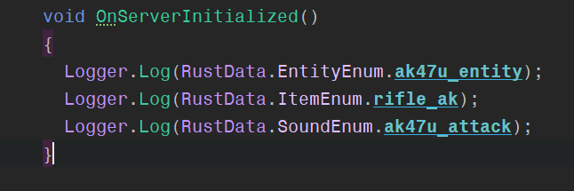

# RustData 

RustData is an extension for the game Rust that helps developers find entities/sounds/items within their IDE.

## Installation

To use RustData, just put the RustData.dll which can be found at "Releases" into your carbon/managed/lib folder of your rust server and reference it in your local project.

Take note: In case you are selling/passing them to someone, the extension has to be on their server as well of course.

## Usage

Here is a picture of how neat it will look like in your IDE:

Opportunities are endless with this extension, I suggest making a wrapper function for the creating effects/items/entities